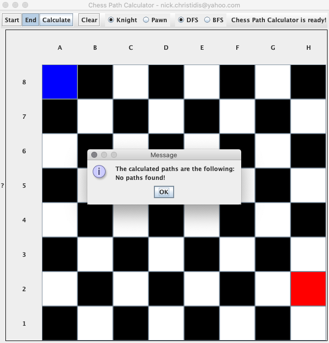

### Assignee: Nikolaos Christidis (nick.christidis@yahoo.com)

### Description

Create a Java console application that should represent an empty chessboard where the user will be able to enter a starting position and an ending position.

The application should then calculate a list of all possible paths that one knight (αλογάκι) piece
in the starting position could take to reach the ending position in 3 moves.

Some inputs might not have a solution,
in this case the program should display a message that no solution has been found.
Otherwise, the shortest path (if that exists) should be returned.

Please note:
- A graphical display is not required.
- Input can be given by the command line, a text file or whatever you might prefer.
- Output could also be kept simple: just print out the path in a textual format (i.e. A2 -> B5 etc)
- Emphasis will be given on the algorithm, general code structure and how the program could be extended.
- Unit tests would be highly appreciated

### Technical Decisions

* For calculating the path, two approached have been used, [DFS](src/main/java/com/chriniko/chess/infra/path/DFSPathCalculator.java) 
and [BFS](src/main/java/com/chriniko/chess/infra/path/BFSPathCalculator.java).

* The solution is extensible for a different piece, just extend [Piece](src/main/java/com/chriniko/chess/infra/piece/Piece.java) class
and provide the eligible moves for the chess piece type implementation (eg: [Pawn](src/main/java/com/chriniko/chess/infra/piece/Pawn.java))

### Running unit tests
* For the assignment I have wrote only unit tests (no need for integration test with failsafe-plugin, etc), so
in order to execute them run: `mvn clean test`

### Build and Run
* Execute: `mvn clean install`
* Execute: `java -jar target/xm-nick-christidis-assignment-1.0-SNAPSHOT.jar`
* You should see the following application window: 

### Screenshots

